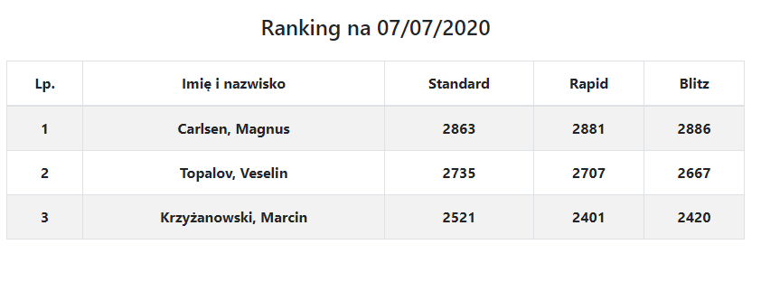

# FIDE Rating List Generator

Simple app to generate and automatically update FIDE rating lists. 

## Backend: 
Made in NodeJS with ExpressJS and MongoDB database. Because FIDE does not provide API, server is based on: https://github.com/xRuiAlves/fide-ratings-scraper/

Server gets and reads given config file (by `FIDE_IDS` variable in `.env` file) and provides the following addidtional endpoints:

* `/rating-list/update` - Protected by basic HTTP Auth. Username is `admin` and password is set in `.env` file (`UPDATE_PASSWORD`). If authorized, connects to database and refreshes current players' rating data. Returns result from database query in JSON. This endpoint is also requested automatically at 3 a.m. every day.
* `/rating-list` - Gets rating data from database in JSON file.

## Frontend:
Very simple frontend, because whole app is just a table. Made in ReactJS with react-bootstrap library.

## Deploy

App is pre-configured for launch on Heroku - `heroku-postbuild` is set to build react fronend properly.

### Enviroment variables - .env file
```text
CONNECTION_STRING=      // Connection string to MongoDB database. Personally, I recommend MongoDB Atlas.
FIDE_IDS=               // URL to *.json file containing FIDE IDs and names to replace (see below in section: Config file)
UPDATE_PASSWORD=        // Password entered to manually update list
DB_NAME=                // Name of MongoDB database
DB_COLLECTION_NAME=     // Name of collection in MongoDB database
```

### Config *.json file

File may be put somewhere else than the main app, to allow players list modification without the need of rebuilding the app. It has the following structure:

```json
{
	"ids": [1503014,
            1132199,
            2900084
			],
	"replace" : [
		["Krzyzanowski", "Krzyżanowski"]
	]
}
```

* `ids` - Array of FIDE IDs of players on the list
* `replace` - Array of pairs containing name's part to be replaced by the second. The purpose is to correct FIDE mistakes or invalid diacritical marks in some languages. (Like in the screenshot below)

## Application screenshot:




## Author:
[Jacek Nitychoruk](https://github.com/Jck-eN)
